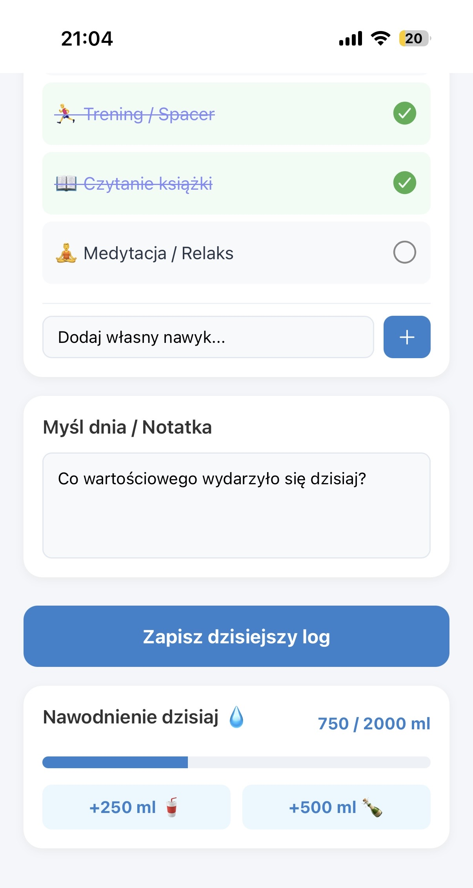
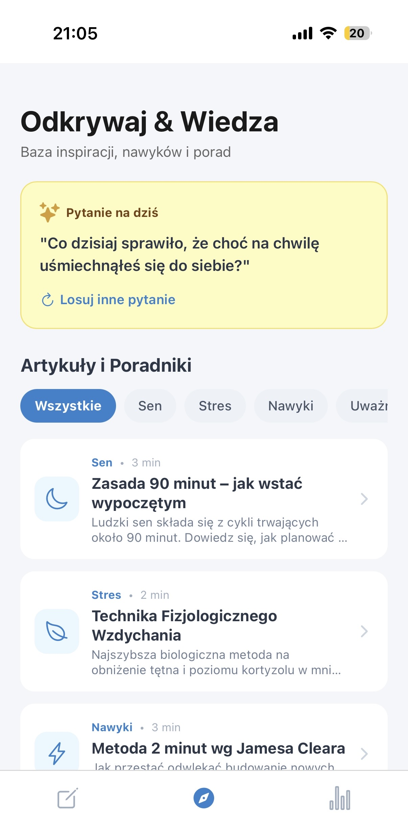
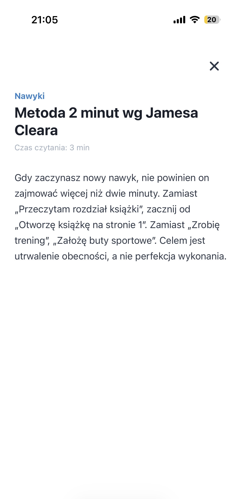
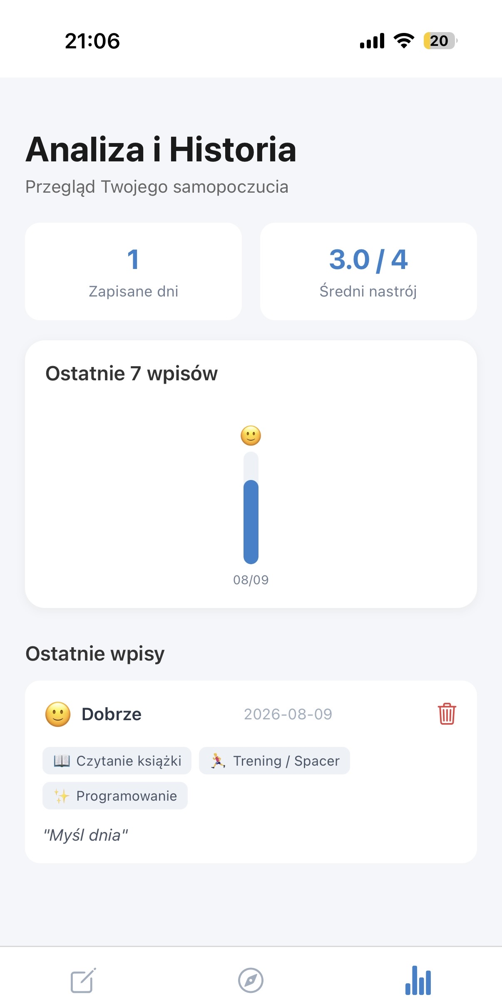

# Osobisty Dziennik Nawyków i Nastroju

Mobilna aplikacja stworzona w **React Native**, mająca na celu wsparcie użytkowników w budowaniu zdrowych nawyków, zarządzaniu stresem oraz codziennej refleksji. Aplikacja łączy w sobie funkcje mood-trackera, habit-trackera oraz bazy wiedzy o wellbeingu.

## Główne funkcje 

- ** Codzienny Log:** Szybki zapis nastroju, wypitej wody oraz notatki (Myśl dnia).
- ** Zarządzanie Nawykami:** Wbudowana lista pro-zdrowotnych nawyków z możliwością dodawania, odznaczania i usuwania **własnych** celów.
- ** Historia i Statystyki:** Interaktywny podgląd minionych dni, wyliczanie średniego nastroju oraz wizualny wykres 7-dniowy.
- ** Baza Wiedzy:** Zbiór krótkich, merytorycznych artykułów (np. Zasada 90 minut, Metoda 5-4-3-2-1) oraz codziennych pytań do dziennika .
- ** Haptic Feedback:** Reakcje wibracyjne na akcje użytkownika (dodanie nawyku, wypicie wody), co znacznie podnosi jakość UX.

---

### 1. Ekran Główny (`Dzisiaj`)
Główny punkt wejścia aplikacji służący do codziennego wprowadzania danych.

* **Rejestracja Nastroju:** Skala 4-stopniowa (Słabo, Średnio, Dobrze, Świetnie). Wybór podświetla właściwy moduł i natychmiastowo aktualizuje stan aplikacji.
* **Monitor Nawyków:**
   Pozwala na szybkie odznaczanie wykonanych w danym dniu czynności.
Zaznaczenie nawyku powoduje dynamiczną zmianę stylu (przekreślenie tekstu, zielone tło).
Personalizacja: Użytkownik może z poziomu ekranu dodać własny nawyk, jak i usunąć wcześniej dodane pozycje.

Notatka / Myśl Dnia: Pole tekstowe umożliwiające zapisanie refleksji z danego dnia.

Licznik Nawodnienia: Moduł do monitorowania spożycia wody z wizualnym paskiem postępu

### 2. Ekran Edukacji i Inspiracji (`Odkrywaj`)
Baza wiedzy wspierająca użytkownika w budowaniu zdrowych nawyków i higienie psychicznej.

* **Pytanie na Dziś:** Wylosowane pytanie skłaniające do refleksji .
* **Filtrowanie Artykułów:** Kategoryzacja treści (Wszystkie, Sen, Stres, Nawyki, Uważność) ułatwiająca wyszukiwanie.
* **Baza Artykułów:** Lista zwięzłych materiałów edukacyjnych z podanym szacowanym czasem czytania .

### 3. Ekran Analizy i Historii (`Historia`)
Moduł służący do weryfikacji postępów, analizy samopoczucia i przeglądu historycznych wpisów.

* **Szybkie Statystyki:** Górny panel podsumowujący łączną liczbę zarejestrowanych dni oraz średnią wartość nastroju.
* **Wykres 7-dniowy:** Wizualny słupkowy podgląd nastroju z ostatnich wpisów wraz 
* **Karty Wpisów:** Lista historycznych logów ułożona chronologicznie. Każda karta zawiera:
  * Ocenę nastroju z datą wpisu.
  * Tagi zrealizowanych tego dnia nawyków.
  * Notatkę tekstową.
  * Przycisk usunięcia wpisu z bazy danych.

