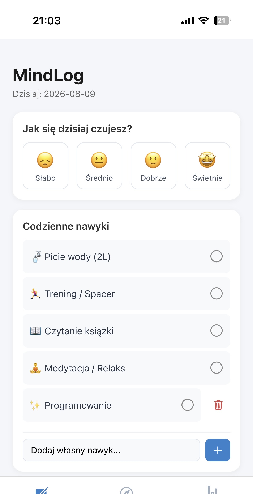
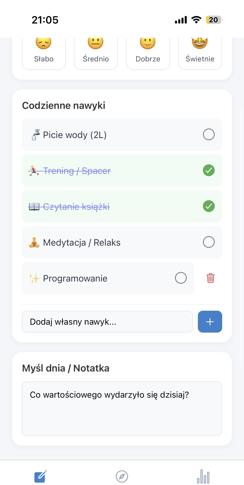

# Osobisty Dziennik Nawyków i Nastroju

Mobilna aplikacja stworzona w **React Native**, mająca na celu wsparcie użytkowników w budowaniu zdrowych nawyków, zarządzaniu stresem oraz codziennej refleksji. Aplikacja łączy w sobie funkcje mood-trackera, habit-trackera oraz bazy wiedzy o wellbeingu.

## Główne funkcje 

- ** Codzienny Log:** Szybki zapis nastroju, wypitej wody oraz notatki (Myśl dnia).
- ** Zarządzanie Nawykami:** Wbudowana lista pro-zdrowotnych nawyków z możliwością dodawania, odznaczania i usuwania **własnych** celów.
- ** Historia i Statystyki:** Interaktywny podgląd minionych dni, wyliczanie średniego nastroju oraz wizualny wykres 7-dniowy.
- ** Baza Wiedzy:** Zbiór krótkich, merytorycznych artykułów (np. Zasada 90 minut, Metoda 5-4-3-2-1) oraz codziennych pytań do dziennika .
- ** Haptic Feedback:** Reakcje wibracyjne na akcje użytkownika (dodanie nawyku, wypicie wody), co znacznie podnosi jakość UX.

---

### 1. Ekran Główny (`Dzisiaj`)
Główny punkt wejścia aplikacji służący do codziennego wprowadzania danych.
* **Rejestracja Nastroju:** Skala 4-stopniowa (Słabo, Średnio, Dobrze, Świetnie). Wybór podświetla właściwy moduł i natychmiastowo aktualizuje stan aplikacji.
* **Notatka / Myśl Dnia:** Pole tekstowe umożliwiające zapisanie refleksji z danego dnia.
* **Licznik Nawodnienia:** Moduł do monitorowania spożycia wody z wizualnym paskiem postępu

